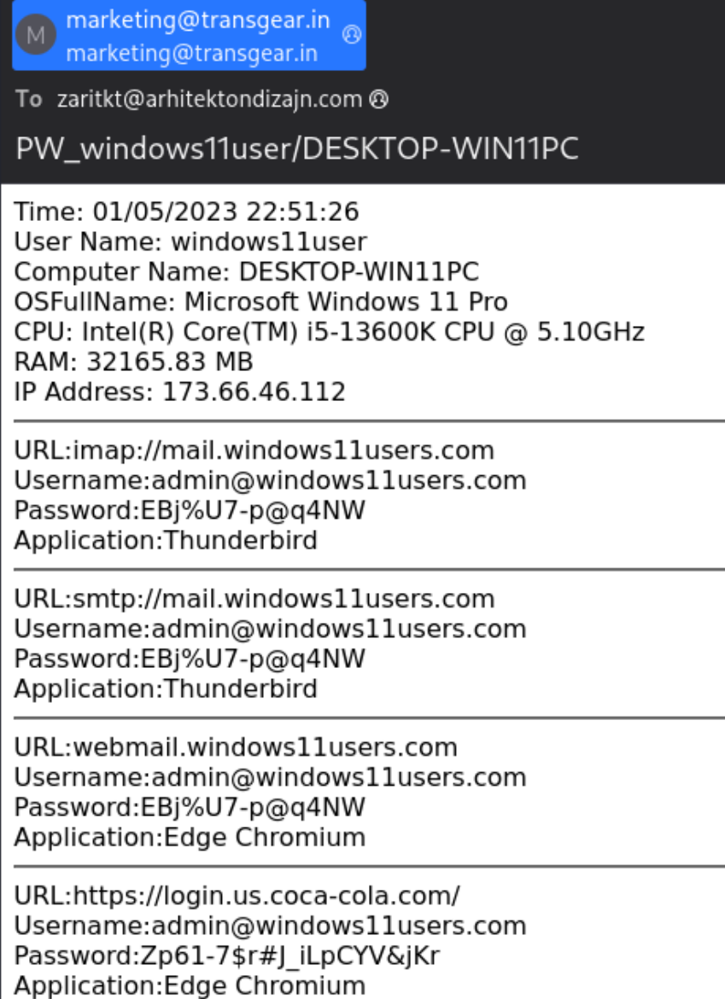

### Scenario

Earlier this month, Palo Alto Networks Unit 42 tweeted about Agent Tesla-style activity from a possible OriginLogger infection that was found Thursday,
Jan. 5, 2023. The [original tweet](https://x.com/Unit42_Intel/status/1611379660029366273) contains our initial analysis. 
You can also find further information on the associated malware binary.

---
### Workflow & write up

1. Check what's in export objects
2. Check object hashes on virus total
3. See packet and see the whole stream of conversation
4. Find machine info and who is infected
---

---

### Report
Executive Summary:
On 2023-01-05 at 22:51 UTC, a windows computer was infected with generic Trojan malware in a formal of .png image format. After the infection, information such as computer's ram, 
cpu, hostname, and user name are being extracted. Credentials has also been stolen through SMTP in clear text.

Event Time (UTC):
 - 2023-01-05 22:51:00.319186

Victim Details:
 - IP Address: 192.168.1.27
 - MAC Address: bc:ea:fa:22:74:fb
 - Host name: DESKTOP-WIN11PC
 - Windows User Account: windows11user

IoCs:
 - Malicious object (image/png) downloaded Ztvfo.png (Identify as trojan on [VT](https://www.virustotal.com/gui/file/90d977ca0a3331d78005912d2b191d26e33fa2c6ef17602d6173164ba83fd85e/detection))
 - IP Address reached by victim for the above download: 45.56.99.101 (also malicious on [VT](https://www.virustotal.com/gui/ip-address/45.56.99.101))
 - URL reached for the above download: savory.com.bd (also malicious on [VT](https://www.virustotal.com/gui/domain/savory.com.bd))

Post Infection events:
 - Credentials and machine information stolen with SMTP in clear text

