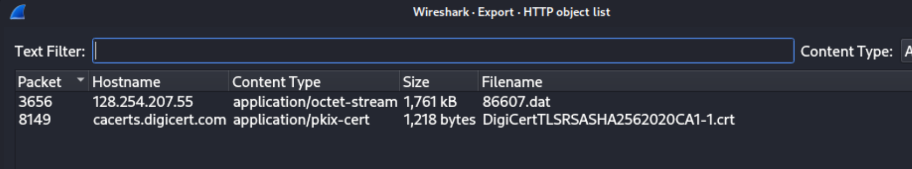
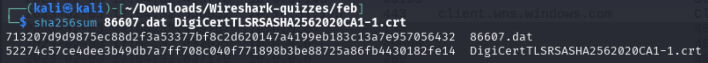
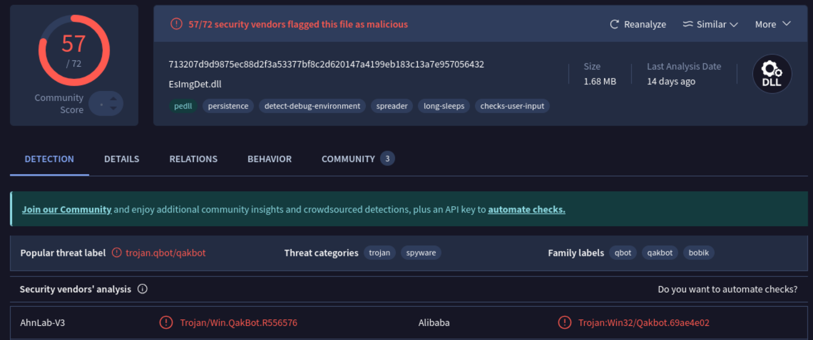
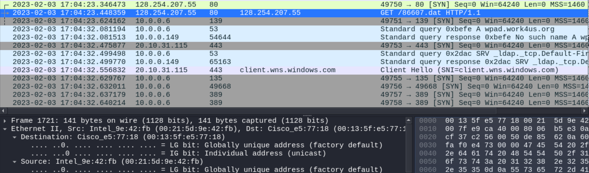
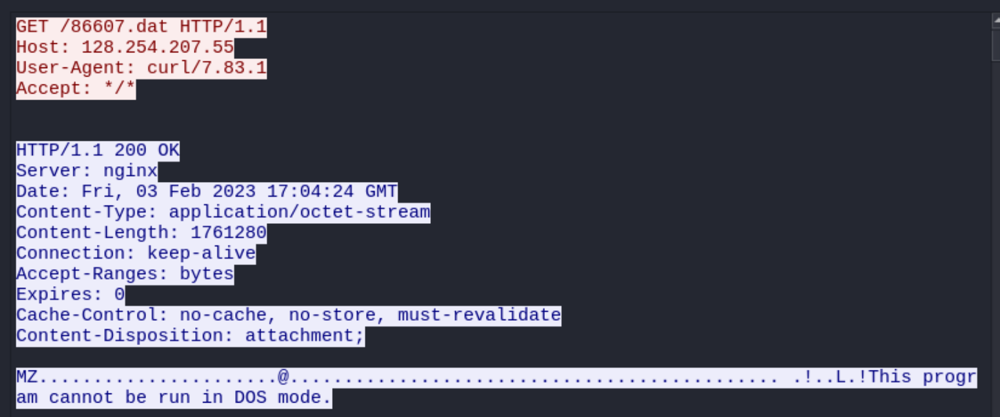
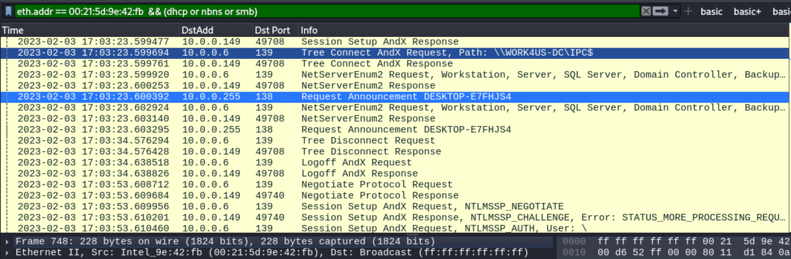
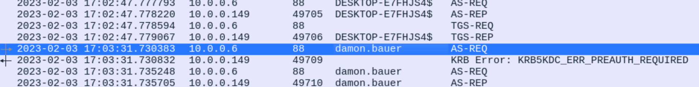

### Scenario

The pcap for this month’s Wireshark quiz is from an AD environment, 
and it contains real-world traffic from a simulated enterprise setting. 
Details of the local area network (LAN) from the pcap follow.

- LAN segment range: 10.0.0[.]0/24 (10.0.0[.]0 through 10.0.0[.]255)
- Domain: work4us[.]org
- Domain Controller IP address: 10.0.0[.]6
- Domain Controller host name: WORK4US-DC
- LAN segment gateway: 10.0.0[.]1
- Land segment broadcast address: 10.0.0[.]255

---
### Workflow & write up

1. Check what's in export objects
2. If not a lot of objects, check object hashes on virus total
3. See packet and see the whole stream of conversation
4. Find machine info and who is infected

---
1. Export objects from wireshark, hash it and check on virus total

export from wireshark

hash in sha256

VT saying that it's a trojan.qbot

2. Find the infected machine info

The wireshark info will show the IP, and Mac addr for the download

Follow stream and go to the http request header and you will find the time of first request

Search the ip addr/mac addr to and dhcp to find the host name

Use the filter `kerberos contains "DESKTOP-E7FHJS4"` to find all kerberos packets related to this host, apply cname as a colume
and see what user logged into the host

---
### Report
Executive Summary:

On UTC 2023-02-03 at 17:04, Damon Bauer's Windows computer was infected by Qakbot(Qbot) Malware. Qakbot is a banking trojan that
is capable of stealing sensitive financial information, and propagating through networks, it is possible that the Domain 
controller has also been infected and further investigation is needed.

Event Time (UTC):
 - 2023-02-03 17:04:23.448359

Victim Details:
 - IP Address: 10.0.0.149
 - MAC Address: 00:21:5d:9e:42:fb
 - Host name: DESKTOP-E7FHJS4
 - Windows User Account: damon.bauer

IoCs:
 - Malicious object 86607.dat (SHA256 Hash:52274c57ce4dee3b49db7a7ff708c040f771898b3be88725a86fb4430182fe14) dowloaded from `hxxp://128.254.207[.]55/86607.dat`
 - Various malicious dlls were downloaded after the first infection
 - ARP scanning from the infected Windows host for lateral movement
