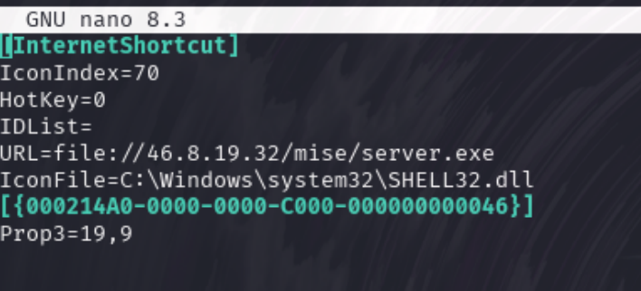
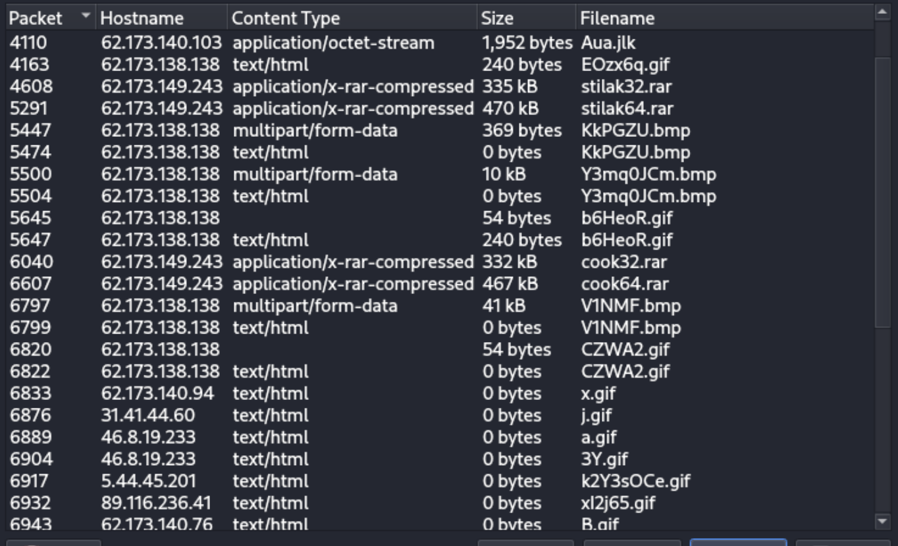

### Scenario

A threat hunt revealed the same activity seen from the Unit 42 tweet in your organization Tuesday, March 7, 2023, at approximately 02:07 UTC.

Details of the local area network (LAN) for this month’s exercise follow.

LAN segment range: 172.16.1[.]0/24 (172.16.1[.]1 through 172.16.1[.]255)

Domain: pcapworkshop[.]net

Domain Controller IP address: 172.16.1[.]16

Domain Controller host name: PCAPWORKSHOP-DC

LAN segment gateway: 172.16.1[.]1

Land segment broadcast address: 172.16.1[.]255

---
### Workflow & write up

1. Check what's in export objects
2. Check object hashes on virus total
3. See packet and see the whole stream of conversation
4. Find machine info and who is infected
---

### Report
Executive Summary:
On 2023-03-07 at 02:01 UTC, a windows computer was infected with Trojan ursnif malware in a formal of zip file. The zip file was a script to initial a further payload (server.exe)
It then generates a series of encoded or encrypted malicious downloads from the the clients c2 server.

Event Time (UTC):
 - 2023-03-07 02:01:56

Victim Details:
 - IP Address: 172.16.1.137
 - MAC Address: 00:02:fb:34:b4:fa
 - Host name: DESKTOP-3GJL3PV (windows 10)
 - Browser Agent: Microsoft Edge (version 110.0.1587.63)
 - Windows User Account: sherita.kolb

IoCs:
 - Malicious object (.zip) downloaded Cliente.zip (Identify as trojan.ursnif on [VT](https://www.virustotal.com/gui/file/33db5b2a2cc592fd10c65ba38396e4c7574ad78e786d78e8a3acdc93a90c3209))
 - IP Address reached by victim for the above download: 173.254.32.85 (also malicious on [VT](https://www.virustotal.com/gui/ip-address/173.254.32.85))
 - URL reached for the above download: unapromo.com (also malicious on [VT](https://www.virustotal.com/gui/domain/unapromo.com))

Post Infection events:
 - Heaps of malicious traffic generated

