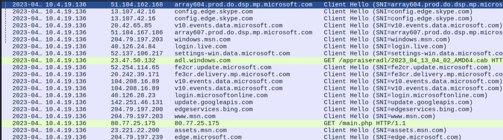
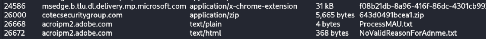
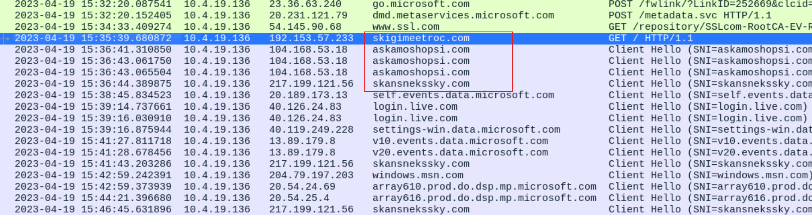
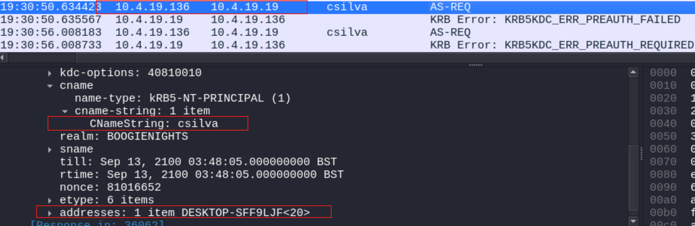

### Scenario

Traffic for the IcedID infection occurred in an Active Directory (AD) environment during April 2023. This infection is similar to previous IcedID activity from March 24, 2023.

Local Area Network (LAN) Details
LAN segment range: 10.4.19[.]0/24 (10.4.19[.]1 through 10.4.19[.]255)
Domain: boogienights[.]live
Domain controller IP address: 10.4.19[.]19
Domain controller hostname: WIN-GP4JHCK2JMV
LAN segment gateway: 10.4.19[.]1
LAN segment broadcast address: 10.4.19[.]255

---
### Write Up

As usual, I love to check the downloads first. However, there are many downloads in this packet, thus we will just try to read the traffic directly.

It is weird that normal staff would type the ip address as url, looking at the full conversation, it redirects to a new website.
Checking the 2 url we can see the redirected website is in fact malicious [(VT scan)]
(https://www.virustotal.com/gui/url/bb5b6a8153c5ee763749b8e06a2ae1c2f8b51a3c041c84064c7cd82aba353362).
Also, looking at [URLhaus](https://urlhaus.abuse.ch/url/2614322/), we can already identify the malware is IcedID, and the payload 
from this website is a zip file.

Checking the above zip file's sha hash, it is indeed malicious as well as the website.

After doing some readings, icedID will usually do a get request without a proper URL, thus we just need to look a bit down after
first infection point. 

Checking all of the domains, and IP addresses, it is indeed all malicious on VirusTotal.

Now lets find the info of the infected endpoint with kerberos, dhcp traffic.

---

### Report
Executive Summary:

On UTC 2023-04-19 at 15:31, csilva's Windows computer was infected by icedID Malware by serving the URL 
hxxp://80.77.25[.]175/main.php. While this address is clean on VirusTotal, it redirects the user to a malicous webpage with 
the icedID malware. icedID is a banking trojan which is capable of stealing credentials, installing back doors and key logging. It
is likely that other online machines have also been infected by IcedID. 

Event Time (UTC):
 - 2023-04-19 15:31:08.049140

Victim Details:
 - IP Address: 10.4.19.136
 - MAC Address: 14:58:d0:2e:c5:ae
 - Host name: DESKTOP-SFF9LJF
 - Windows User Account: csilva

IoCs:
 - Malicious object 643d0491bcea1.zip (SHA256 Hash:eb4db357dc6f2dd8facf132ecaf6916e7219bf0e29990601b1f4babefa4d02f9) dowloaded from `hxxps[://]firebasestorage[.]googleapis[.]com/v0/b/serene-cathode-377701[.]appspot[.]com/o/XSjwp6O0pq%2FScan_Inv[.]zip?alt=media&token=a716bdce-1373-44ed-ae89-fdabafa31c61`
 - Malicious end points: 103.168.53.18, 217.199.121.56
 - Malicious domains: [askamoshopsi[.]com](https://www.virustotal.com/gui/domain/askamoshopsi.com), [skansnekssky[.]com](https://www.virustotal.com/gui/domain/skansnekssky.com), [cotecsecuritygroup[.]com](https://www.virustotal.com/gui/domain/cotecsecuritygroup.com)
