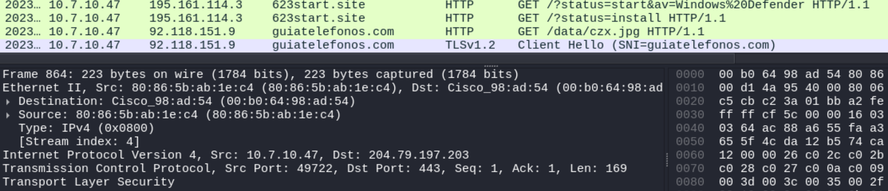

### Scenario

The pcap for this month’s Wireshark quiz is from an AD environment, 
and it contains real-world traffic from a simulated enterprise setting. 
Details of the local area network (LAN) from the pcap follow.

- LAN segment range: 10.7.10[.]0/24 (10.7.10[.]1 through 10.7.10[.]255)
- Domain: coolweathercoat[.]com
- Domain controller IP address: 10.7.10[.]9
- Domain controller hostname: WIN-S3WT6LGQFVX
- LAN segment gateway: 10.7.10[.]1
- LAN segment broadcast address: 10.7.10[.]255

---
### Write up

The first suspicious traffic is the going to the host 623start[.]site, checking on VT, it is indeed malicious. So this will be the initial point of infection.

Lets identify the host and machine info using kerboros, dhcp and smb

Following the first infection, the IP: 92.118.151[.]9 and the Domain: guiatelefonos[.]com is also malicious and the malware Redline stealer is downloaded in a form of jpg 
([MalwareBazaar](https://bazaar.abuse.ch/sample/3c42b93801f02696487de64bb623f81cf7baf73a379a46e1459ca19ae7dc2454/))

Investigating the post infected traffic, it is clear that many information has been transfered to the C2 server including machine specification, crypto wallet, loggin info etc

---
### Report
Executive Summary:

On UTC 2023-07-10 at 22:39, rwalters' Windows computer was infected by redline stealer Malware. RedLine Stealer is an info harvesting malware that
steals information through browsers such as saved credentials, autocomplete data, and credit card information. System details such as username, location data,
hardware configuration, and information regarding installed security software is also included when the malware is installed on the victim. The malware has the
ability to upload and download files, execute commands, and periodically send back information about the infected computer.

Event Time (UTC):
 - 2023-07-10 22:39:47.579630	

Victim Details:
 - IP Address: 10.7.10.47
 - MAC Address: 80:86:5b:ab:1e:c4
 - Host name: DESKTOP-9PEA63H
 - Windows User Account: rwalters

IoCs:
 - Malicious object czx.jpg (SHA256 Hash:3c42b93801f02696487de64bb623f81cf7baf73a379a46e1459ca19ae7dc2454)
 - Malicious IP: 195.161.114[.]3, 92.118.151[.]9
 - Malicious Domain: 623start[.]site, guiatelefonos[.]com
 - User, machine info, and screenshot of user desktop was send back 
