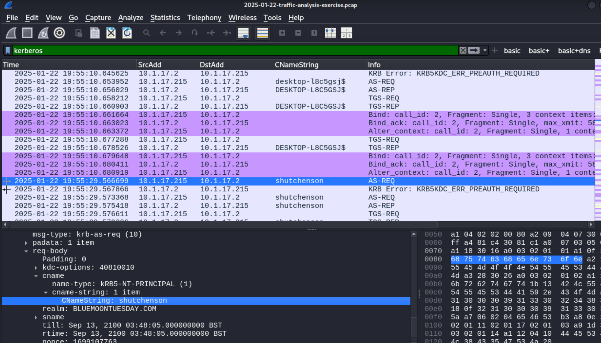

# Malware Traffic Analysis 2025 Jan exercise

Scenario: You work as an analyst at a Security Operation Center (SOC). Someone contacts your team to report a coworker has downloaded a suspicious file 
after searching for Google Authenticator. The caller provides some information similar to social media posts at:

- [https://www.linkedin.com/posts/unit42_2025-01-22-wednesday-a-malicious-ad-led-activity-7288213662329192450-ky3V/](https://www.linkedin.com/posts/unit42_2025-01-22-wednesday-a-malicious-ad-led-activity-7288213662329192450-ky3V/)
- [https://x.com/Unit42_Intel/status/1882448037030584611](https://x.com/Unit42_Intel/status/1882448037030584611)

Based on the caller's initial information, you confirm there was an infection.  You retrieve a packet capture (pcap) of the associated traffic.  
Reviewing the traffic, you find several indicators matching details from a Github page referenced in the above social media posts.  
After confirming an infection happened, you begin writing an incident report.

 
LAN SEGMENT DETAILS FROM THE PCAP

- LAN segment range:  10.1.17[.]0/24   (10.1.17[.]0 through 10.1.17[.]255)
- Domain:  bluemoontuesday[.]com
- Active Directory (AD) domain controller:  10.1.17[.]2 - WIN-GSH54QLW48D
- AD environment name:  BLUEMOONTUESDAY
- LAN segment gateway:  10.1.17[.]1
- LAN segment broadcast address:  10.1.17[.]255

### Write Up

### Report
Executive Summary:

On UTC 2025-01-22 at 19:45, shutchenson's Windows computer was infected by a trojan Malware. It is highly likely that this was cause by a fake login page immitating the google
Authenticator login.

Event Time (UTC):
 - 2025-01-22 19:45:56.827936		

Victim Details:
 - IP Address: 10.1.17.215
 - MAC Address: 00:d0:b7:26:4a:74
 - Host name: DESKTOP-L8C5GSJ$	
 - Windows User Account: shutchenson

IoCs:
 - Malicious object 264872[.]ps1 (SHA256 Hash:b8ce40900788ea26b9e4c9af7efab533e8d39ed1370da09b93fcf72a16750ded),
 - 264872 (SHA256 Hash: c74123dbccded43fda61651e102750b041d4c3af6fda88cd6436f9276653e103),
 - pas.ps1 (SHA256 Hash: a833f27c2bb4cad31344e70386c44b5c221f031d7cd2f2a6b8601919e790161e)
 - Malicious IP/C2 server: 5.252.153[.]241, 45.125.66[.]32, 

